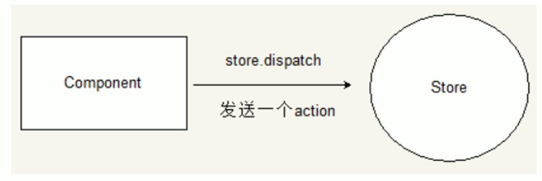
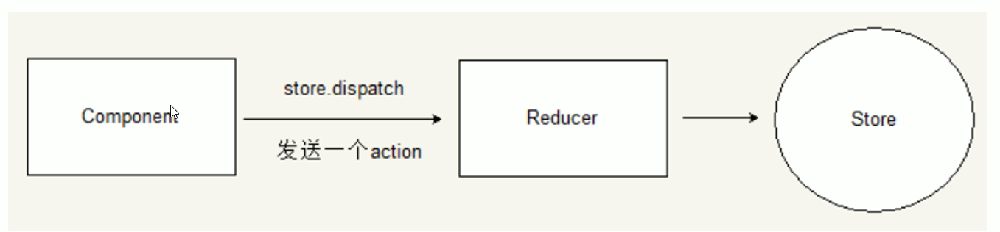
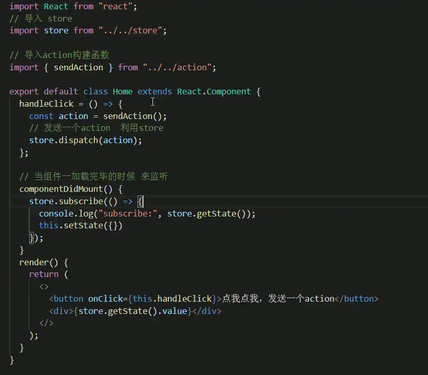
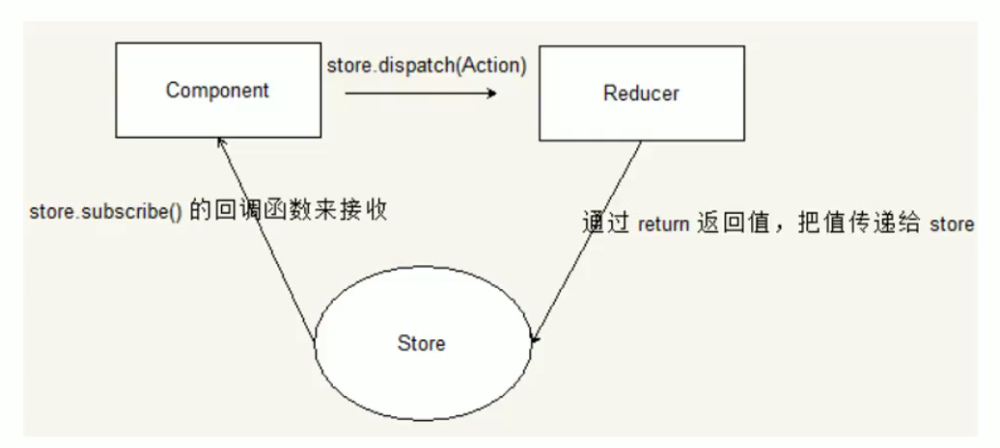
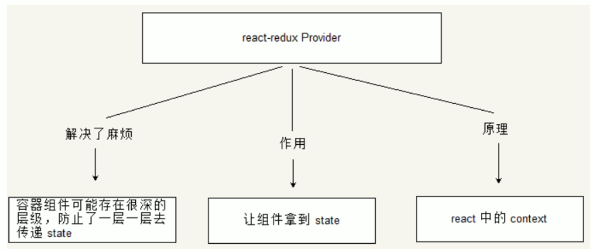
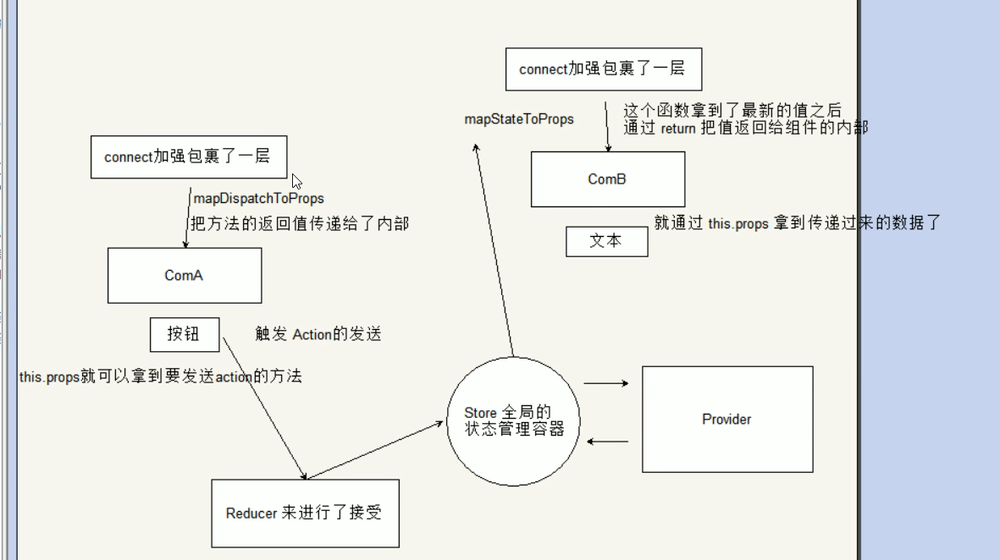

# 	尚硅谷React学习

## 大纲

1. react基础
2. hooks
3. 组件模式
4. 状态管理
5. 性能优化技巧

 

 

 

 

 

 


## React简介

1. **jsx构建虚拟dom**，通过**bable转成真实dom**
2. 模块：一个js文件就是一个模块
3. 组件：实现局部功能的代码和资源的集合

## React面向组件编程

1. 创建组件

   ```jsx
   // 类式创建
   class Mycomponent extends React.component {
       render() {
           return <h1>标签</h1>
       }
   }
   ReactDOM.render(<Mycomponent/>,document.getElementById('root'))
   ```

2. 三大属性

   - state属性

     ```jsx
     class Weather extends React.component {
         state = {isHot:false,wind:'微风'}
         render() {
             const {isHot,wind} = this.state
             return <h1 onClick={this.changeWeather}>今天天气很{ isHot ? '炎热' : '寒冷'},{wind}</h1>
         }
         changeWeather() {
             const isHot = this.state.isHot
             this.setState({isHot:!isHot})
         }
     }
     
     ReactDOM.render(<Weather/>,document.getElementById('root'))
     ```

     注意事项：

     1. **更改状态用setState**
     2. **组件自定的方法this指向为undefined**，添加this.changeWeather**.bind(this)** 或者 使用**箭头函数**

   - props属性

     ```jsx
     class Person extends React.component{
         render() {	
             const {name,age,sex} = this.props	
             return(	
             	<ul>	
                 	<li>姓名：{name}</li>	
                     <li>年龄：{age}</li>	
                     <li>性别：{sex}</li>	
                 </ul>	
             )	
         }	
     }	
     
     ReactDOM.render(<Person name='zs' age={19} sex='男' speak={speak} />,document.getElementById('root1'))
     
     const p = {name:'lisi',age:18,sex:'女'}
     ReactDOM.render(<Person {...p} />,document.getElementById('root2'))
     
     function speak() {
         console.log('我说话了')
     }
     ```

     给props数据添加限制

     ```jsx
     class Person extends React.component{
         render() {
             const {name,age,sex} = this.props
             return(
             	<ul>
                 	<li>姓名：{name}</li>
                     <li>年龄：{age}</li>
                     <li>性别：{sex}</li>
                 </ul>
             )
         }
     }
     
     Person.protoTypes = {
         name:ProtoTypes.string.isRequired,
         sex:ProtoTypes.string,
         age:ProtoTypes.number
     }
     
     Person.defaultProps = {
         age:18,
         sex:'男'
     }
     
     ReactDOM.render(<Person name='zs'/>,document.getElementById('root1'))
     ```

   - refs属性

     ```jsx
     class Demo extends React.Component {
         showData = () => {
             const {input1} = this.refs
             alert(input1.value)
         }
         
         showData2 = () => {
             const {input2} = this.refs
             alert(input2.value)
         }
         
         render() {
             return(
             	<div>
                 	<input ref='input1'/>
                     <button onClick = { this.showData }>点我提示左侧数据</button>
                     <input ref='input2' onBlur={this.showdata2} />
                 </div>
             )
         }
     }
     ```

     上述效率不高，不被官方推荐。

     更推荐使用createRef

     ```jsx
     class Demo extends React.Component{
         myRef = React.createRef()
         myRef2 = React.createRef()
         showData = ()=> {
             alert(this.myRef.current.value)
         }
         showData2 = ()=> {
             alert(this.myRef2.current.value)
         }
         
         render() {
             return(
             	<div>
                 	<input ref={this.myRef} />
                     <button onClick={this.showData}>点击我提示左侧的数据</button>
                     <input ref={this.myRef2} onBlur={ this.showData2 }/>
                 </div>	
             )
         }
     }
     ReactDOM.render(<Demo a='1' b='2'/>,document.getElementById('root'))
     ```

     注意事项：**不要过度使用reft**

   - 事件处理：onXxx（注意大小写）

3. 受控组件和非受控组件

   - 非受控组件：使用了ref,不推荐

   - **受控组件：使用onChange+state实现，减少ref的使用**

     ```jsx
     class login extends React.Component{
         state = {usename:"",password:""}
         saveUsername = (e)=> {
             this.setState({username: e.target.value})
         }
         savePassword = (e)=> {
             this.setState({password: e.target.value})
         }
         handleSubmit = (e)=> {
             e.preventDefault() // 阻止表单提交
             const {username,password} = this.state
             alert(`你输入的账号是：${username}，密码是：${password}`)
         }
         
         render() {
             return(
             	<form onSubmit={this.handleSubmit}>
                 	用户名：<input onChange={this.saveUsername}/>
                     密码：<input onChange={this.savePassword} />
                 </form>
             )
         }
     }
     ```

4. 高阶函数

   - 若A函数，**接收到的参数是函数**
   - 若A函数，**调用的返回值是函数**，如Promise，setTimeout，arr.map

5. 生命周期

   初步知识点：

   - 行内样式写法：style={{opacity: opacity}}
   - 属性名和属性值相同时:{opacity:opacity} 简写为 {opacity}
   - **render执行次数：n + 1次**（初始渲染次数+n次更新）

   生命周期的三个阶段：

   1. 初始阶段：render触发初次渲染
      - constructor()
      - componentWillMount()
      - **render() 常用**
      - **componentDidMount() 常用**，开启定时器、发送网络请求、订阅消息
   2. 更新阶段：组件内部this.setState()或父组件重新render触发
      - shouldComponentUpdate()
      - componentWillUpdate()
      - render()
      - compoentDidUpdate()
   3. 卸载组件：ReactunmountComponentAtNode触发
      - **componentWillUnmount() 常用**，关闭定时器、取消订阅

   最新版本的生命周期

   1. 可能会删除的三个生命周期：componentWillMount、componentWillUpdate、componentWillRecieveProps
   2. 添加的两个生命周期：getDerivedStateFromProps【适用于罕见用例（**几乎不用**）】和getSnapshotBeforeUpdate【在更新之前获取快照，返回值传递给`componentDidUpdate()`】

6. 虚拟DOM和diff算法

   - 步骤：

     1. 创建虚拟dom树（jsx对象）
     2. 真实dom树
     3. 绘制界面显示
        1. setState()更新状态
        2. 重新创建虚拟dom树
        3. 新旧树比较差异
        4. 更新差异对应真实dom
        5. 局部界面重绘

   - react/vue中的key有什么作用

     1. **key是虚拟dom对象的标识**，在更新dom时key起关键作用

     2. 数据变化时，会生成新的虚拟dom，新旧虚拟dom进行比较时，规则如下：

        在旧dom中找到和新dom相同的key

        - 如果虚拟dom内容没有变，使用之前的真实dom
        - 如果虚拟dom内容改变，生成新的真实dom，随后替换掉页面中之前的真实dom

        在旧dom中没有找到和新dom相同的key

        - 根据数据创建新的真实dom，随后渲染到页面上

   - 为什么遍历列表时，**key最好不要用index**

     1. 对数据：逆序添加，逆序删除等破坏顺序操作——>会产生没有必要的真实dom更新，效率低
     2. 如果结构中还包含输入类的dom（如input，虚拟DOM中标签属性少，input没有value属性）——>会产生错误的dom，界面有问题
     3. 最好选用数据的唯一标识作为key，如id，手机号等
     4. 如果只是简单数据，用index也没有问题

## React的应用

1. 安装node和npm

   - **react是SPA单页面应用**

2. 脚手架项目结构

   - public静态资源文件夹
   - **index.html主页面**
   - manifest.json配置文件
   - robots.txt爬虫协议
   - src源码文件夹
     - App.css App组件样式
     - **App.js App组件**
     - App.test.js 给App做测试
     - index.css 通用样式
     - index.js  入口文件

   注意：**组件js文件除了首字母大写，还可以将后面名改为jsx，和普通js文件区别**

3. 样式模块化

   ```jsx
   import name from './name.module.css'
   className = {name.title}
   ```

   基本不用，而是用less嵌套

4. 功能界面的组件化流程（通用）

   1. 拆分组件：拆分界面，抽取组件
   2. 实现静态组件：用组件实现静态效果
   3. 实现动态组件：
      1. 动态显示初始化数据
         - 数据类型
         - 数据名称
         - 保存在哪个组件？
      2. 交互

5. 案例——todoList

   - **数据放在state中管理**
   - **父子组件传值用pros**

## React AJAX

1. 理解：前端需要ajax请求向后端发送请求

2. 实现：

   - jquery：需要操作dom，比较重
   - axios：轻量级，建议使用，封装XMLHttpRequest对象的ajax，promise风格，可以用在浏览器和node端

3. 配置代理：

   - 法一：在page.json中配置`"proxy":"http://localhost:5000"`——只能配置一个代理，但是配置简单

   - 法二：

     1. 在src下创建配置文件：src/setupProxy.js(不允许改名)

     2. 编写代码：

        ```js
        const proxy = require('http-proxy-middleware')
        
        module.exports = function(app) {
          app.use(
            proxy('/api1', {  //api1是需要转发的请求(所有带有/api1前缀的请求都会转发给5000)
              target: 'http://localhost:5000', //配置转发目标地址(能返回数据的服务器地址)
              changeOrigin: true, //控制服务器接收到的请求头中host字段的值
              /*
              	changeOrigin设置为true时，服务器收到的请求头中的host为：localhost:5000
              	changeOrigin设置为false时，服务器收到的请求头中的host为：localhost:3000
              	changeOrigin默认值为false，但我们一般将changeOrigin值设为true
              */
              pathRewrite: {'^/api1': ''} //去除请求前缀/api1，保证交给后台服务器的是正常请求地址(必须配置)
            }),
            proxy('/api2', { 
              target: 'http://localhost:5001',
              changeOrigin: true,
              pathRewrite: {'^/api2': ''}
            })
          )
        }
        ```

        可以配置多个代理，但是配置繁琐，前端请求资源时必须加上前缀

4. 解决跨域：在server.js中加入以下代码（即在后端解决）——CORS解决方法

   ```js
     //设置响应头  设置允许跨域  
     response.setHeader('Access-Control-Allow-Origin', '*');
     //响应头
     response.setHeader('Access-Control-Allow-Headers', '*');
   ```

5. 案例

   1. 解构赋值+重命名

      ```js
      let obj = {a: {b: 1} }
      const { a } = obj // 传统解构
      const { a:{b} } = obj // 连续解构赋值
      const { a:{b:value} } = obj // 连续解构赋值+重命名
      ```

   2. fetch请求

      ```js
      	try {
      		const response= await fetch(`/api1/search/users2?q=${keyWord}`)
      		const data = await response.json()
      		console.log(data);
      	} catch (error) {
      		console.log('请求出错',error);
      	}
      ```

## React路由

1. 相关理解

   - SPA：单页面，多组件

     1. 点击链接**不会整体刷新**，而是页面**局部刷新**
     2. 数据需要通过**ajax请求**获取

   - 路由的理解

     1. 什么是路由？

        1. 一个路由就是一个key：value的映射关系

        2. **key值是路径，value是组件或者函数**

     2. 路由的分类？

        - 后端路由

          1. 理解：**value是函数，用来处理客户端提交的请求**

          2. 注册路由：router.get(path, function(req,res));

          3. 工作过程：node接收到请求——>根据请求路径找到路由——>调用路由的函数处理请求——>返回响应数据

        - 前端路由

          1. 理解：**value是组件，展示页面内容**

          2. 注册路由：<Router path="/test" component={Test} />

          3. 工作过程：浏览器的path变为/test时，路由组件变为Test组件

   - react-router-dom的理解

     1. react的插件库
     2. 专用于SPA应用
     3. 基于react项目基本会用到这个库

2. 路由的基本使用

   1. 明确页面的导航区，展示区

   2. 导航区的a标签改为link标签

   3. 展示路由

      ```jsx
      <Routes>
      	<Route path="/about" element={<About/>}/>
          <Route path="/home" element={<Home/>}/>
      </Routes>
      ```

3. 路由组件和一般组件

   |               | 一般组件                     | 路由组件                                       |
   | ------------- | ---------------------------- | ---------------------------------------------- |
   | 写法          | `<Demo />`                   | `< Route path='/demo' component={Demo}  />`    |
   | 存放位置      | components中                 | page中                                         |
   | 接收到的props | 组件标签传递什么，就收到什么 | 接收三个固定的属性：`history、location、match` |

4. NavLink

   1. NavLink实现路由链接的高亮，通过activeClassName指定样式名

   2. 标签内容通过this.props.children获取

      ```jsx
      <NavLink activeClassName='atguigu' children="About" />
      // 等价于
      <NavLink activeClassName='atguigu' to="/about">About</NavLink>
      ```

5. switch包裹所有路由

6. 解决样式丢失

   1. **什么时候样式丢失？ ——> 路由路径多级，且刷新的时候**

   2. 解决办法

      - 在public/index.html引入样式时**不写./ 而是写 /**，因为./ 是相对路径，去掉之后就是绝对路径

        ```jsx
        <link rel="stylesheet" href="/css/bootstrap.css" >
        ```

      - 在public/index.html引入样式时**不写./ 而是写 %PUBLIC_URL%**，因为%PUBLIC_URL%是绝对路径

        ```jsx
        <link rel="stylesheet" href="%PUBLIC_URL/css/bootstrap.css" >
        ```

      - 将<BrowserRouter/>改为<HashRouter/>

7. 路由的模糊匹配和严格匹配

   1. 默认是模糊匹配：【输入的路径】包含【匹配的路径】，且顺序要一致

      ```jsx
      <MyNavLink to="/about/a/b">Home</MyNavLink>  //模糊匹配
      <Route path="/about" component={About}/>
      ```

   2. 开启严格匹配

      ```jsx
      <Route exact={true} path="/about" component={About}/> // exact={true} 简写为exact
      ```

   3. 严格匹配不能随便开启，需要再开，有的时候开启会导致无法继续匹配二级路由

8. React重定向

   1. 一般**写在所有路由的下方，当所有路由都无法匹配时，跳转到React指定的路由**

   2. 具体编码

      ```jsx
      <Switch>
      	<Route path="/about" component={About}/>
      	<Route path="/home" component={Home}/>
      	<Redirect to="/about"/>
      </Switch>
      ```

9. 嵌套路由

   1. 注册子路由要写上父路由的值

      ```jsx
      {/* 注册路由 */}
      <Switch>
      	<Route path="/home/news" component={News}/>
      	<Route path="/home/message" component={Message}/>
      	<Redirect to="/home/news"/>
      </Switch>
      ```

   2. 路由的匹配是按照注册路由的顺序进行的

10. 向路由组件传递参数

    1. **params传参(常用)**

       - 路由链接（携带参数）

         ```jsx
         <Link to='/demo/test/tom/18'>详情</Link>
         ```

       - 注册路由（声明接收）

         ```jsx
         <Route path='/demo/test/:name/:age' component={Test}/>
         ```

    2. search传参

       - 路由链接(携带参数)：

         ```jsx
         <Link to='/demo/test/?name=tom&age=18'}>详情</Link>
         //？前面加不加/
         ```

       - 注册路由(无需声明，正常注册即可)：

         ```jsx
         <Route path="/demo/test" component={Test}/>
         ```

       - 接收参数：`this.props.location.search`
         备注：获取到的search是urlencoded编码（即 name=tom&age=18）字符串，需要借助querystring解析（querystring.stringify(obj), querystring.parse(str)）。去掉问号用qs.parse(str.slice(1)

    3. state传参

       - 路由链接(携带参数)：

         ```jsx
         <Link to={{pathname:'/demo/test',state:{name:'tom',age:18}}}>详情</Link>
         ```

       - 注册路由(无需声明，正常注册即可)：

         ```jsx
         <Route path="/demo/test" component={Test}/>
         ```

       - 接收参数：`this.props.location.state`
         备注：刷新也可以保留住参数

11. push和replace

    1. 路由是对浏览器历史记录的操作，总共有两种操作，**push（压栈）和replace（替代栈顶元素）**。
    2. 默认是push模式，要想开启replace模式，则**在路由连接`<Link>`标签中加入`replace={true}`或`replace`**

12. 编程式路由导航

    借助**this.prosp.history对象上的API对操作路由跳转、前进、后退**，而不用路由的`<Link>`和`<NavLink>`，但还是要注册路由

    - this.prosp.history.push()
    - this.prosp.history.replace()
    - this.prosp.history.goBack()
    - this.prosp.history.goForward()
    - this.prosp.history.go()

13. withRouter的使用

    1. withRouter可以加工一般组件，让一般组件具备路由组件所特有的API

    2. withRouter的返回值是一个新组件。

    3. 在一般组件中要用到路由组件的props属性时引入。

       ```jsx
       import {withRouter} from 'react-router-dom'
       ```

       需要暴露

       ```jsx
       export default withRouter(Header)
       ```

14. BrowserRouter与HashRouter的区别

    1. 底层原理不一样：
       - BrowserRouter使用的是H5的history API，不兼容IE9及以下版本
       - HashRouter使用的是URL的哈希值。
    2. path表现形式不一样
       - BrowserRouter的路径中没有#,例如：localhost:3000/demo/test
       - HashRouter的路径包含#,例如：localhost:3000/#/demo/test
    3. 刷新后对路由state参数的影响
       - BrowserRouter没有任何影响，因为**state保存在history对象中**
       - **HashRouter刷新后会导致路由state参数的丢失！！！**

    4. 备注： HashRouter可以用于解决一些路径错误相关的问题。

## React UI组件库

1. 简介

   1. material-ui(国外)

      官网: http://www.material-ui.com/#/
      github: https://github.com/callemall/material-ui

   2. ant-design(国内蚂蚁金服)

      官网: https://ant.design/index-cn
      Github: https://github.com/ant-design/ant-design/
      不是所有场景都使用，最适用于后台管理系统

2. 使用

   安装依赖:`npm install antd`
   引入样式（不太合理，引入了全部组件的样式，应该**按需引入**）

   ```jsx
   import '../node_modules/antd/dist/antd.css'
   ```

   引入库：

   ```jsx
   import { Button,DatePicker } from 'antd';
   import {WechatOutlined,WeiboOutlined,SearchOutlined} from '@ant-design/icons'
   ```

3. 按需引入和自定义主题

   **重点：** 学会查看[文档](https://ant.design/docs/react/use-with-create-react-app-cn)（3.x文档更清楚，且适用于4.x）

   1. 安装依赖：`yarn add react-app-rewired customize-cra babel-plugin-import less less-loader`

   2. 修改package.json

      ```jsx
      "scripts": {
      	"start": "react-app-rewired start",
      	"build": "react-app-rewired build",
      	"test": "react-app-rewired test",
      	"eject": "react-scripts eject"
      },
      ```

   3. 根目录下创建config-overrides.js

      ```jsx
      //配置具体的修改规则
      const { override, fixBabelImports,addLessLoader} = require('customize-cra');
      module.exports = override(
      	fixBabelImports('import', {
      		libraryName: 'antd',
      		libraryDirectory: 'es',
      		style: true,
      	}),
      	addLessLoader({
      		lessOptions:{
      			javascriptEnabled: true,
      			modifyVars: { '@primary-color': 'green' },
      		}
      	}),
      );
      ```

      备注：不用在组件里亲自引入样式了，即：`import 'antd/dist/antd.css'`应该删掉

## Redux理解

1. redux理解

   1. 学习文档

      - [英文文档](https://redux.js.org/): https://redux.js.org/

      - [中文文档](http://www.redux.org.cn/): http://www.redux.org.cn/

      - [Github](https://github.com/reactjs/redux): https://github.com/reactjs/redux

   2. redux简介

      1. redux是做状态管理的js库
      2. 可以用在vue、react、angular中，主要还是用在react中
      3. 作用：集中式管理react应用中多个组件共享的状态

   3. 什么时候用

      1. 某个组件的状态，需要让别的组件拿到（共享）
      2. 一个组件改变另一个组件的状态（通信）
      3. 原则：能不用就不用，若不用比较吃力才用

   4. redux工作流程

      

      - dispatch是一个函数，action是一个对象

      - action Creators 服务员、Store 老板、Reducers 厨师

2. redux是三个核心概念

   - action

     1. 动作的对象
     2. 两个属性：
        - type：标识属性，字符串形式，唯一，必要属性
        - data：数据属性，任意类型，可选属性
     3. 例子：`{type:'ADD_STUDENT',data:{name:'tom',age:19} }`

   - reducer

     1. 初始化状态、加工状态
     2. 加工时，根据旧的state和action，产生新的state纯函数

   - store

     1. 将state、action、reducer联系在一起的对象

     2. 如何拿到这个对象

        ```jsx
        import {createStore} from 'redux'
        import reducer from './reducer'
        const store = createStore(reducer)
        ```

     3. 此对象的功能

        - getState 拿到state
        - dispatch(action) 分发action，触发reducer调用，产生新的state
        - subscribe(listener) 注册监听，当产生新的state时，自动调用

3. redux核心API

   1. createStore() ：创建包含指定reducer的store管理对象

   2. store对象

      1. 作用：redux库最核心的管理对象
      2. 内部维护：state和reducer

   3. 核心方法：getState、dispatch(action)、subscribe(listener)：监听redux里的状态变化，发送则会被调用

   4. 具体编码

      ```jsx
      store.getState()
      store.dispatch({type:"INCREAT",number })
      store.subscribe( ()=> {
          ReactDOM.render(<APP/>,document.getElementByID('root'))
      })
      ```

4. applyMiddleware()

   作用：应用上基于redux的中间件(插件库)

5. combineReducers()

   作用：合并多个reducer函数


# React官网

## 描述UI

### 1.第一个组件

```
function Congratulations () {
  return (
    <h1>干得漂亮</h1>
  )
}

export default function Grtulations() { 
  return(
    <div>
      <h1>你好</h1>
      <Congratulations />
    </div>
  )
}
```

- 通过export default导出组件
- return 后面如果换行 或者 有多个标签——>需要加 ()——> 括号内部有多个标签时，要有一个大的标签包裹所有标签
- 组件的首字母一定要大写

### 2.导入导出

默认导出和具名导出

| 语法 | 导出语句                              | 导入语句                                |
| ---- | ------------------------------------- | --------------------------------------- |
| 默认 | `export default function Button() {}` | `import Button from './Button.js';`     |
| 具名 | `export function Button() {}`         | `import { Button } from './Button.js';` |

**同一文件中，有且仅有一个默认导出，但可以有多个具名导出！**

### 3.JSX书写标签语言

- 在react中，逻辑和标签共存在一个地方——组件
- react组件只能返回一个根标签，需要一个父标签把它们包裹起来——<></>空标签，Fragment，不会给HTML解构添加额外节点
- 标签必须闭合 <h1></h1>或者
- 大部分HTML用驼峰法命名——className，部分也有stroke-width形式的

### 4.JSX中通过大括号使用js

1. 使用大括号：

   - 用作JSX标签的文本：`<h1>{name}'s To Do List</h1>`
   - 用作紧跟在 = 符号后的属性：`src={avatar}`，注意没有引号(如果有引号，那么就是{avatar} 字符串形式的了)

2. 使用双大括号：

   - 内联css样式 `<ul style={{  backgroundColor: 'black', color: 'pink'}}>`

     注意这里的属性使用的驼峰法：background-color ——> backgroundColor

   - 对象 `<Avator person={{name:"zs",imgId:'12ssw21'}} />`

### 5.将props传递给组件

1. 将props传递给子组件

   - 要传递 props，将它们添加到 JSX，就像使用 HTML 属性一样。

   ```jsx
   export default function Profile() {
     return (
       <Avatar
         person={{ name: 'Lin Lanying', imageId: '1bX5QH6' }}
         size={100}
       />
     );
   }
   ```

2. 在子组件中读取props

   - 要读取 props，使用 `function Avatar({ person, size })` 解构语法。

   ```jsx
   function Avatar({ person, size }) {
     // 在这里 person 和 size 是可访问的
   }
   ```

   注意：

   - 不要忘记花括号{  }

   - 利用“解构”拿到值

     ```jsx
     function Avatar(props) {
       let person = props.person;
       let size = props.size;
       // ...
     }
     ```

   - 给prop指定一个默认值

     ```jsx
     function Avatar({ person, size = 100 }) {
       // ...
     }
     ```

3. 使用展开语法

   - 可以使用 `<Avatar {...props} />` JSX 展开语法转发所有 props，但不要过度使用它

   ```jsx
   function Profile(props) {
     return (
       <div className="card">
         <Avatar {...props} />
       </div>
     );
   }
   ```

4. props是只读的，不能直接修改props

### 6.条件渲染

1. 用if返回标签

   ```jsx
   function Item({ name, isPacked }) {
     if (isPacked) {
       return <li className="item">{name} ✔</li>;
     }
     return <li className="item">{name}</li>;
   }
   
   export default function PackingList() {
     return (
       <section>
         <h1>Sally Ride 的行李清单</h1>
         <ul>
           <Item 
             isPacked={true} 
             name="宇航服" 
           />
           <Item 
             isPacked={true} 
             name="带金箔的头盔" 
           />
           <Item 
             isPacked={false} 
             name="Tam 的照片" 
           />
         </ul>
       </section>
     );
   }
   ```

2. 使用三目运算符

   ```jsx
   function Item({ name, isPacked }) {
     	return (
     		<li className="item">
       	{isPacked ? name + ' ✔' : name}
     		</li>
   	);
   }
   ```

3. 在{} 中放标签

   ```jsx
   function Item({ name, isPacked }) {
     return (
       <li className="item">
         {isPacked ? (
           <del>
             {name + ' ✔'}
           </del>
         ) : (
           name
         )}
       </li>
     );
   }
   ```

4. && 运算符

   ```jsx
   function Item({ name, isPacked }) {
     return (
     	<li className="item">
       	{name} {isPacked && '✔'}
     	</li>
   	);
   }
   ```

5. 使用let赋值 —— 最灵活

   ```jsx
   function Item({ name, isPacked }) {
     let itemContent = name;
     if (isPacked) {
       itemContent = name + " ✔";
     }
     return (
       <li className="item">
         {itemContent}
       </li>
     );
   }
   ```

### 7.渲染列表

1. 通过map遍历

   ```jsx
   const people = [
     '凯瑟琳·约翰逊: 数学家',
     '马里奥·莫利纳: 化学家',
     '穆罕默德·阿卜杜勒·萨拉姆: 物理学家',
     '珀西·莱温·朱利亚: 化学家',
     '苏布拉马尼扬·钱德拉塞卡: 天体物理学家',
   ];
   
   export default function List() {
     const listItems = people.map(person =>
       <li>{person}</li>
     );
     return <ul>{listItems}</ul>;
   }
   ```

   - 注意这里会报没有key的警告
   - person=> 后面返回的必须是一个大标签包含所有其它标签

2. filter过滤

   ```jsx
   const chemists = people.filter(person =>
       person.profession === '化学家'
     );
   ```

3. 给遍历的值加上key

   ```jsx
   export default function List() {
   const people = [
     {
       id: 0, 
       name: '凯瑟琳·约翰逊',
     },
     {
       id: 1, 
       name: '马里奥·莫利纳',
     } 
   ];
     const listItems = people.map(person =>
       <li key={person.id}>{person.name}</li>
     );
     return <ul>{listItems}</ul>;
   }
   ```

   - 为什么需要key值

     设想一下，假如你桌面上的文件都没有文件名，取而代之的是，你需要通过文件的位置顺序来区分它们———第一个文件，第二个文件，以此类推。也许你也不是不能接受这种方式，可是一旦你删除了其中的一个文件，这种组织方式就会变得混乱无比。原来的第二个文件可能会变成第一个文件，第三个文件会成为第二个文件……

     React 里需要 key 和文件夹里的文件需要有文件名的道理是类似的。它们（key 和文件名）都让我们可以从众多的兄弟元素中唯一标识出某一项（JSX 节点或文件）。而一个精心选择的 key 值所能提供的信息远远不止于这个元素在数组中的位置。即使元素的位置在渲染的过程中发生了改变，它提供的 `key` 值也能让 React 在整个生命周期中一直认得它。

   - key来自数据库 或者 本地添加的（自增计数器等）

   - **key值不能改变；在兄弟节点之间是唯一的**

   - 如果想让每个列表项都输出多个 DOM 节点而非一个的话，该怎么做呢？

     Fragment 语法的简写形式 `<> </>` 无法接受 key 值，所以只能要么把生成的节点用一个 `<div>` 标签包裹起来，要么使用长一点但更明确的 `<Fragment>` 写法：

     ```jsx
     import { Fragment } from 'react';
     
     // ...
     
     const listItems = people.map(person =>
       <Fragment key={person.id}>
         <h1>{person.name}</h1>
         <p>{person.bio}</p>
       </Fragment>
     );
     ```

4. 案例——将嵌套的列表项组件化

   ```jsx
   export const recipes = [
     {
       id: 'greek-salad',
       name: '希腊沙拉',
       ingredients: ['西红柿', '黄瓜', '洋葱', '油橄榄', '羊奶酪'],
     },
     {
       id: 'hawaiian-pizza',
       name: '夏威夷披萨',
       ingredients: ['披萨饼皮', '披萨酱', '马苏里拉奶酪', '火腿', '菠萝'],
     },
     {
       id: 'hummus',
       name: '鹰嘴豆泥',
       ingredients: ['鹰嘴豆', '橄榄油', '蒜瓣', '柠檬', '芝麻酱'],
     },
   ];
   import { recipes } from './data.js';
   
   function Recipe(props) {
     return(
       <div>
          <h2>{props.name}</h2>
             <ul>
               {props.ingredients.map(ingredient =>
                 <li key={ingredient}>
                   {ingredient}
                 </li>
               )}
             </ul>
       </div>
     )
   }
   export default function RecipeList() {
     return (
       <div>
         <h1>菜谱</h1>
         {recipes.map(recipe =>
             <Recipe {...recipe} key={recipe.id}/>
         )}
       </div>
     );
   }
   ```

### 8.保持组件纯粹

1. 什么是组件纯粹？

   先理解纯函数：

   - **只负责做自己的任务**：不会更改调用该函数之前已经存在的对象或变量
   - **输入相同，输出相同**：给定相同的输入，纯函数总是返回相同的结果（**纯函数仅仅执行计算，因此调用它们两次不会改变任何东西** ）

   **React会假设编写的组件都是纯函数**

2. 副作用：不符合预期的结果

   - 多次调用组件，产生不同的jsx 

     要让返回的jsx依赖于：调用组件时传入的props——传入guest作为props

     ```jsx
     function Cup({ guest }) {
       return <h2>Tea cup for guest #{guest}</h2>;
     }
     
     export default function TeaSet() {
       return (
         <>
           <Cup guest={1} />
           <Cup guest={2} />
           <Cup guest={3} />
         </>
       );
     }
     ```

3. 最好不要对传入的props进行直接修改，**当想要更改数组的任意项时，必须先对其进行拷贝。**

   ```jsx
   export default function StoryTray({ stories }) {
     stories.push({
       id: 'create',
       label: 'Create Story'
     });
   
     return (
       <ul>
         {stories.map(story => (
           <li key={story.id}>
             {story.label}
           </li>
         ))}
       </ul>
     );
   }
   ```

   请注意，每当时钟更新时，“Create Story” 都会被添加 **两次**。这暗示我们在渲染过程中发生了 mutation — 严格模式调用两次组件，可以使这些问题更加明显。

   `StoryTray` 的功能不纯粹。通过在接收到的 `stories` 数组（一个 prop！）上调用 `push` 方法，它正改变着一个在 `StoryTray` 渲染 **之前** 创建的对象。这使得它有问题并且难以预测。

   - 最简单的解决方案是完全不碰数组，单独渲染 “Create Story”：

   ```jsx
   export default function StoryTray({ stories }) {
     return (
       <ul>
         {stories.map(story => (
           <li key={story.id}>
             {story.label}
           </li>
         ))}
         <li>Create Story</li>
       </ul>
     );
   }
   ```

   - 或者，你可以在 push 之前创建一个 **新** 数组（通过复制现有数组）：

   ```jsx
   export default function StoryTray({ stories }) {
     // Copy the array!
     let storiesToDisplay = stories.slice();
   
     // Does not affect the original array:
     storiesToDisplay.push({
       id: 'create',
       label: 'Create Story'
     });
   
     return (
       <ul>
         {storiesToDisplay.map(story => (
           <li key={story.id}>
             {story.label}
           </li>
         ))}
       </ul>
     );
   }
   ```

### 9.将UI视为树

树是项目和 UI 之间的关系模型，通常使用树结构来表示 UI。例如，浏览器使用树结构来建模 HTML（[DOM](https://developer.mozilla.org/docs/Web/API/Document_Object_Model/Introduction)）与CSS（[CSSOM](https://developer.mozilla.org/docs/Web/API/CSS_Object_Model)）。移动平台也使用树来表示其视图层次结构。


与浏览器和移动平台一样，React 还使用树结构来管理和建模 React 应用程序中组件之间的关系。这些树是有用的工具，用于理解数据如何在 React 应用程序中流动以及如何优化呈现和应用程序大小。

## 添加交互

### 1.响应事件

1. 添加事件处理函数

   ```jsx
   export default function Button() {
     function handleClick() {
       alert('你点击了我！');
     }
   
     return (
       <button onClick={handleClick}> // 注意后面不要跟()，否则在渲染的时候就调用了
         点我
       </button>
     );
   }
   
   // OR
   
   <button onClick={function handleClick() {
     alert('你点击了我！');
   }}>
       
   // OR
   
   <button onClick={() => {
     alert('你点击了我！');
   }}>
   
   ```

2. 在事件上读取Props

   ```jsx
   function AlertButton({ message, children }) { 
     return (
       <button onClick={() => alert(message)}> // onClick事件上读取props
         {children}
       </button>
     );
   }
   
   export default function Toolbar() {
     return (
       <div>
         <AlertButton message="正在播放！">
           播放电影
         </AlertButton>
         <AlertButton message="正在上传！">
           上传图片
         </AlertButton>
       </div>
     );
   }
   ```

3. 把事件处理函数作为props传递

   ```jsx
   function Button({ onClick, children }) {
     return (
       <button onClick={onClick}>
         {children}
       </button>
     );
   }
   
   function PlayButton({ movieName }) {
     function handlePlayClick() {
       alert(`正在播放 ${movieName}！`);
     }
   
     return (
       <Button onClick={handlePlayClick}> // handlePlayClick事件作为props传递
         播放 "{movieName}"
       </Button>
     );
   }
   
   function UploadButton() {
     return (
       <Button onClick={() => alert('正在上传！')}>
         上传图片
       </Button>
     );
   }
   
   export default function Toolbar() {
     return (
       <div>
         <PlayButton movieName="魔女宅急便" />
         <UploadButton />
       </div>
     );
   }
   ```

4. 命名事件处理函数prop

   内置组件（`<button>` 和 `<div>`）仅支持 [浏览器事件名称](https://react.docschina.org/reference/react-dom/components/common#common-props)，例如 `onClick`。但是，当你构建自己的组件时，你可以按你个人喜好命名事件处理函数的 prop。

   **按照惯例，事件处理函数 props 应该以 `on` 开头，后跟一个大写字母。**

   ```jsx
   function Button({ onSmash, children }) {
     return (
       <button onClick={onSmash}>
         {children}
       </button>
     );
   }
   
   export default function App() {
     return (
       <div>
         <Button onSmash={() => alert('正在播放！')}> // 自定义的onSmash事件
           播放电影
         </Button>
         <Button onSmash={() => alert('正在上传！')}>
           上传图片
         </Button>
       </div>
     );
   }
   ```

5. 事件传播（冒泡）

   ```jsx
   export default function Toolbar() {
     return (
       <div className="Toolbar" onClick={() => {
         alert('你点击了 toolbar ！');
       }}>
         <button onClick={() => alert('正在播放！')}>
           播放电影
         </button>
         <button onClick={() => alert('正在上传！')}>
           上传图片
         </button>
       </div>
     );
   }
   ```

   点击button后，先alert '正在播放' | '正在上传'，再alert '你点击了 toolbar !'

6. 阻止传播： e.stopPropagation();

   ```jsx
   function Button({ onClick, children }) {
     return (
       <button onClick={e => {
         e.stopPropagation();
         onClick();
       }}>
         {children}
       </button>
     );
   }
   
   export default function Toolbar() {
     return (
       <div className="Toolbar" onClick={() => {
         alert('你点击了 toolbar ！');
       }}>
         <Button onClick={() => alert('正在播放！')}>
           播放电影
         </Button>
         <Button onClick={() => alert('正在上传！')}>
           上传图片
         </Button>
       </div>
     );
   }
   ```

   如果想从上往下执行，在事件名称末尾加上`Capture`实现：onClickCapture

   ```html
   <div onClickCapture={() => { /* 这会首先执行 */ }}>
     <button onClick={e => e.stopPropagation()} />
     <button onClick={e => e.stopPropagation()} />
   </div>
   ```

   分三个阶段传播：

   1. 它向下传播，调用所有的 `onClickCapture` 处理函数。
   2. 它执行被点击元素的 `onClick` 处理函数。
   3. 它向上传播，调用所有的 `onClick` 处理函数。

7. 阻止默认行为：`e.preventDefault()`

   ```jsx
   export default function Signup() {
     return (
       <form onSubmit={e => {
         e.preventDefault();
         alert('提交表单！');
       }}>
         <input />
         <button>发送</button>
       </form>
     );
   }
   ```

### 2.state：组件的记忆

1. 添加一个state变量

   在数据发送变化时，页面需要重新渲染，此时直接修改变量是无法实现的，所以需要添加useState

   ```jsx
   import { useState } from 'react'; // 1.先引入useState
   import { sculptureList } from './data.js';
   
   export default function Gallery() {
     const [index, setIndex] = useState(0); // 2.index作为变量初始化为0，setIndex用于修改变量
   
     function handleClick() {
       setIndex(index + 1); // 3.执行修改index的操作
     }
   
     let sculpture = sculptureList[index];
     return (
       <>
         <button onClick={handleClick}>
           Next
         </button>
         <h3>  
           ({index + 1} of {sculptureList.length})
         </h3>
       </>
     );
   }
   ```

   注意：Hooks——以use开头的函数——**只能在组件或者自定义Hook的最顶层调用**

   - 使用useState：`const [thing, setThing] = useState('')`
   - 什么时候使用state？ **组件需要多次渲染“记住”某些信息时使用state**

2. 赋予一个组件多个state变量

   ```jsx
   const [index, setIndex] = useState(0);
   const [showMore, setShowMore] = useState(false);
   ```

3. State是隔离且私有的

   **如果渲染一个组件两次，每个副本都会有完全隔离的state。state 完全私有于声明它的组件**

### 3.渲染和提交

1. 

### 4.state如同一张快照

### 5.把一系列state加入队列

### 6.更新state的对象

### 7.更新state的数组

## 状态管理

### 1.用state响应输入

### 2.选择state结构

### 3.在组件间共享状态

### 4.对state进行保留和重置

### 5.状态迁移逻辑至Reducer中

### 6.使用Context深层传递参数

### 7.使用Reducer和Context扩展你的应用

## 脱围机制

### 1.使用ref引用值

### 2.使用ref操作dom值

### 3.使用Effect同步

### 4.可能不需要Effect

### 5.响应式Effect生命周期

### 6.将事件从Effect中分开

### 7.移除Effect依赖

## 构建TodoList项目

1. 静态页面搭建

   - css是导入的

   - className

   - return () 内部只有一个外标签<></>

   - 循环遍历数组展示：**注意有key的设置**

     ```jsx
     {
         todos.map(todo => {
             return(
             	<li key={todo.id}> 
                 	<lable><input type="checkbox" checked={todo.completed}/>{todo.tiltle}</lable>
                     <button className="btn danger">Delete</button>
                 </li>
             )
         })
     }
     ```

2. 初始化数据

   - 引入useState()——>通过setThing修改state

   - onClick、onChange、onInput

   - setTodos()正常来说只会更新一次，除非在里面加()=>{}

   - setTodos(currentTodos =>{}) // 这里的currentTodos 正是todos数组

   - 注意在**传递数据**的时候，不要直接使用myFunc(data)，而是使用箭头函数传递() => myFunc(data)

     ```jsx
     <button onClick={()=>delete(todo.id)}</button>>
     	DELETE
     </button>
     ```

   - 使用&&制造短路显示html

     ```jsx
     {todos.length === 0 && "No Todos"}
     ```

3. 分解组件

   - 把TodoForm分离出去——>出现不同组件的数据通信问题

   - props

     ```jsx
     <TodoForm onSubmit={addTodo}/>
     
     export function TodoForm(props) {
         props.onSubmit(newItem)
     } 
     // 处理props之外，也可以使用解构 如{ onSubmit }
     ```

   - 将TodoList分离出去——>注意子组件的事件，由父组件触发——>所以**子组件的函数都拿出来，放到父组件中**，在调用子组件的时候再把函数传递过去

   - 将TodoList的TodoItem分离出去

     ```jsx
     <TodoItem id={todo.id} title={todo.title} complete={todo.complete}/>
     
     <TodoItem {...todo} id={todo.id}
     ```

4. 数据持久化

   - 使用useEffect，只要监听到的数据发生变化，就会调用内部的函数

     ```jsx
     useEffect(() => {
         localStorage.setItem('ITEMS',JSON.stringify(todos))
     },[todos])
     ```

   - 获取到本地存储的值

     ```jsx
     const [todos,setTodos] = useState(() => { 
         const localValue = localStorage.getItem('ITEMS')
         if(localValue == null) return []
         
         return JSON.parse(localValue)
     })
     ```

   - 钩子函数必须放在函数顶部：useState、useEffect

## 吴悠编程

### 核心语法

1. 主推使用函数式组件，因为类式组件相对复杂，有很多生命周期

2. useState修改对象时的注意点：

   - 使用useState修改数据是【覆盖原数据的】，所以当修改一个对象，应该把整个对象放入useState中（用...obj），再把要修改的属性和值放在...obj后面（这里的新属性会覆盖obj中对应的属性）

   - ```jsx
     function App() {
     	const [data,setData] = useState({
             title:"默认标题",
             text:"默认内容"
         })
         function handleClick() {
     		setData({
                 ...data,
                 text:"新内容" // 会覆盖上面data中的text
             })
         }
     }
     ```

### 组件通信和插槽

1. 给组件添加style

   ```jsx
   
   
   // 更建议
   const imgStyle = {
       width:200,
       height:"200px"
   }
   
   ```

2. 多个属性用变量名代替

   ```jsx
   function App() {
       const imgData = {
           className:"small",
           style:{
               width:200,
       		height:"200px"
           }
       }
       return (
       	<div {...imgData}/>
       )
   }
   ```

   - 注意：这里的`<div {...imgData}/>`并不是ES6的解构赋值语法，它是jsx特有的？

3. 传递属性active，默认为true

   ```jsx
   function Article({title,active}) {
   	return(
       	<div>
           	<h3>{title}</h3>
               <p>状态：{active ? "显示" : "隐藏"}</p>
           </div>
       )
   }
   export default function App() {
   	return(
       	<>
           	<Article title="标题1" active/>
           	<Article title="标题2"/>
           	<Article title="标题3" active/> // 写了就默认为true
           </>
       )
   }
   ```

4. 默认插槽

   ```jsx
   function List({children}) {
       return (
       	<ul>
           	{children}
           </ul>
       )
   }
   
   export default function App() {
       return (
       	<List >
           	<li>我是插槽内容1</li>
               <li>我是插槽内容2</li>
               <li>我是插槽内容3</li>
           </List>
       )
   }
   ```

5. 具名插槽

   ```jsx
   function List({children,footer = <div>默认底部</div>}) {
       return (
       	<ul>
           	{children}
           </ul>
           {footer}
       )
   }
   
   export default function App() {
       return (
       	<List footer={<p>列表底部内容</p>}>
           	<li>我是插槽内容1</li>
               <li>我是插槽内容2</li>
               <li>我是插槽内容3</li>
           </List>
           
           <List>
           	<li>我是插槽内容A</li>
               <li>我是插槽内容B</li>
               <li>我是插槽内容C</li>
           </List>
       )
   }
   ```

   - 注意：父组件传给子组件的值都是只读的，子组件不要修改传来的数据

6. 子传父组件：通过函数调用传递

   ```jsx
   function Detail({onActive}) {
       const [status,setStatus] = useState(false)
       function handleClick() {
           setStatus(!status)
           onActive(status)
       }
       return (
       	<button onClick={handleClick}>点击修改status</button>
       )
   }
   
   export default function App() {
       function handleActive(status) {
           console.log(status)
       }
       return (
       	<Detail onActive={handleActive}/>
       )
   }
   ```

7. 同级组件传值：createContext

   ```jsx
   export function Section({children}) {
       return (
       	<section>
           	{children}
           </section>
       )
   }
   
   export function Heading({level,children}) {
       switch(level) {
           case 1:
               return <h1>{children}</h1>
           case 2:
               return <h2>{children}</h2>
           case 3:
               return <h3>{children}</h3>
           default: 
               return Error('未知的 level：' + level)
       }
   }
   
   export default function App() {
       return (
       	<div>
           	<Section>
               	<Heading level={1}>主标题</Heading>
                   <Section>
               		<Heading level={2}>副标题</Heading>
                   	<Section>
               			<Heading level={3}>子标题</Heading>
               		</Section>
               	</Section>
               </Section>
           </div>
       )
   }
   
   
   // 去掉上面的level，用levelContext代替
   export function Section({children}) {
       const level = useContext(LevelContext)
       return (
       	<section>
               <LevelContext.Provider value={level + 1}>
                   {children}
               </LevelContext.Provider>
           </section>
       )
   }
   
   export function Heading({children}) {
       const level =  useContext(LevelContext) // 拿到LevelContext的值
       switch(level) {
           case 1:
               return <h1>{children}</h1>
           case 2:
               return <h2>{children}</h2>
           case 3:
               return <h3>{children}</h3>
           default: 
               return Error('未知的 level：' + level)
       }
   }
   
   const LevelContext = createContext(0) // 给level设置初始值0
   export default function App() {
       return (
       	<div>
           	<Section>
               	<Heading}>主标题</Heading>
                   <Section>
               		<Heading>副标题</Heading>
                   	<Section>
               			<Heading>子标题</Heading>
               		</Section>
               	</Section>
               </Section>
           </div>
       )
   }
   ```

### Hooks速成

1. Reducer

   ```jsx
   function countReducer(state,action) {
   	switch(action.type) {
           case "increment":
               return state + 1
           case "decrement":
               return state - 1
           default:
               throw new Error()
       }
   }
   
   export default function App() {
       const [state,dispatch] = useReducer(countReducer,0)
       const handleIncrement = () => dispatch({type:"increment"})
       const handleDecrement = () => dispatch({type:"decrement"})
       
       return (
       	<>
           	<button onClick={handleIncrement}>+</button>
           	<span>{state}</span>
          		<button onClick={handleDecrement}>-</button>
           </>
       )
   }
   ```

   CodeGeex AI工具：自动生成代码

   添加`/`解释代码，debug，生成注释等等

2. useRef 记住修改之前的值

   ```jsx
   export default function App() {
       const [count,setCount] = useState(0)
       const prevCount = useRef()
       
       function handleClick() {
           prevCount.current = count
           setCount(count + 1)
       }
       
       return (
       	<div>
           	<p>最新的count：{count}</p>
               <p>上次的count：{prevCount.current}</p>
               <button onClick={handleClick}>增加count</button>
           </div>
       )
   }
   ```

3. useRef实现子组件功能访问的目的

   ```jsx
   const Child = forward(function (props,ref) {
       useImperativeHandle(ref, () => {
           myFn:() => {  // 暴露给父组件的方法
               console.log("子组件的myFn方法")
           }
       })
       return (
       	<div>子组件</div>
       )
   })
   
   export default function App() {
       const childRef  = useRef()
       function handleClick() {
           childRef.current.myFn()
       }
       return (
       	<>
           	<Child ref={childRef} />
           	<button onClick = {handleClick}>按钮</button>
           </>
       )
   }
   ```

4. React会执行组件两次，以检查函数是否出现不纯的情况

5. 副作用函数useEffect

   ```jsx
   export default function App() {
       const [count,setCount] = useState(0)
       const handleIncrement = () => setCount(count + 1)
       const handleDecrement = () => setCount(count - 1)
       useEffect(() => {
           console.log("useEffect")  // 组件渲染时自动执行
       },[count]) // 依赖count，当count改变时，副作用函数执行
       
       return (
       	<>
           	<button onClick={handleIncrement}>+</button>
           	<span>{count}</span>
          		<button onClick={handleDecrement}>-</button>
           </>
       )
   }
   ```

### 综合案例

​	todoList

## 黑马 — Redux

### 1.Redux - 组成

1. State状态：传递的数据

   - 服务端的数据：用户的信息，商品列表
   - 决定UI展示的状态：弹框的显隐，受控组件
   - APP级别：loding

2. Ation事件：本质是js对象，把数据从组件传递store的载体——执行哪个操作方法的key、传递的参数

   -  
   - 必须要有一个type属性来表示要执行的动作

3. Reducer：本质是函数，用来响应发送来的actions，再经过处理把state发送给store

   - 注意：reducer函数中要有return返回值，这样store才能接收到数据

   - 函数会接收两个参数，第一个是初始化的state，第二个是action

     ```js
     const initData = {
         // 初始化的数据
     }
     rootReducer = (state = initData,action) => {
         // 根据state更新数据
         return {
             // 返回数据给store
         }
     }
     ```

   -  

4. Store：把action和reducer联系在一起的对象

   - 主要职责：

     1. 维持 state
     2. 提供 getState() 获取state
     3. 提供 **dispatch() 发送action**
     4. 通过 **subscribe() 注册监听**
     5. 通过 subscribe() 返回值来注销监听

   - 创建store

     ```js
     import { createStore } from 'redux'
     const store = createStore(传递reducer)
     ```

### 2.Redux - 入门案例

1. 准备工作

   - 构建react：npx create-react-app redux-demo
   - 删除多余文件
   - 在pages目录新建home组件：在src文件夹新建pages
   - 编写简单样式
   - 在App.js引入组件
   - 安装redux：npm i redux

2. 创建一个Action

   - src中创建一个文件夹Action

   - 在该文件夹中新建index.js文件，用来构建action·

   - 在action创建函数里面利用return，返回一个action对象，注意携带type属性

     `const sendAction = () => { return { type:"send_action",value:"发送了一个action" } }`

   - 把action创建函数导出

     `module.exports = { sendAction }`

3. 创建一个Reducer

   - src中创建一个文件夹Reducer

   - 在该文件夹中创建一个index.js文件，用来创建reducer，注意要接收两个参数

   - 第一个参数是默认状态，可以定义一个初始化的state，然后再赋值

   - 在函数中判断第二个参数action的type值是否是我们发送的

   - 如果是就通过return返回新的state

     ```js
     const initState = {
         value:"默认值"
     }
     const reducer = (state = initState,action) => {
     	switch(action.type) {
             case "send_type":
                 return Object.assign({},state,action)
             default:
                 break;
         }
     }
     ```

   - 把reducer导出

     `module.exports = { reducer }`

4. 创建Store

   - src中创建一个文件夹Store

   - 在该文件夹中新建一个index.js文件，用来构建store，注意createStore函数的第一个参数是reducer

     ```js
     import { createStore } from 'redux'
     import { reducer } from '../reducer'
     const store = createStore(reducer)
     
     
     // 因为createStore被弃用，使用@reduxjs/toolkit
     import { configureStore } from '@reduxjs/toolkit'
     import { reducer } from '../Reducer/index'
     const store = configureStore(
         {reducer} // 注意这里要加上大扩号
     )
     ```

   - 将store导出

     `export default store`

5. 在Home组件使用

   - 给页面的button绑定一个点击事件

   - 在组件加载完毕后通过store进行 监听器的注册，返回值可以用来注销监听

     ```js
     this.unSubscribe = store.subscribe(() => {
         // ...
     })
     ```

   - 在点击事件处理函数中，通过store.dispatch 发送一个action

     ```js
     handleClick = () => { store.dispatch( sendAction() ) }
     ```

   -  

     <div>{store.getState() && store.getState().value}</div>

6. 总结

    

### 3.React - Redux 概述

1. 概述：react-redux能够使React组件从Redux store中**很方便的读取数据**，并且向store中分发actions以此来更新数据

2. 两个重要部分，**Provider**：组件能够使整个app都能获取到store中数据； **connect**：能够使组件跟store进行关联

3. Provider：

   - Provider**包裹在根组件最外层**，使所有子组件都可以拿到state

   - Provider**接收store作为props，然后通过context往下传递**，这样react所有组件都可以通过context获取到store

      

4. connect：

   - Provider内部组件如果**想要用到state中的数据，就需要connext进行层层包裹**
   - connect就是方便我们组件能够获取到store中的state

### 4.React - Redux 入门案例

1. 前期准备

   - 安装相关依赖

     npm i redux

     npm i react-redux

     npm i @reduxjs/toolkit

   - 构建store和reducer

     1. 创建store/index.js文件，构建reducer来响应actions

     2. 创建reducer/index.js文件，通过createStore方法把reducer传进来

        ```js
        const initState = {
            count: 0
        }
        export.reducer = (state = initState,action) => {
            switch (action.type) {
                case "add_action":
                    return {
                        count: state.count + 1
                    }
                default:
                    return state
            }
        }
        ```

     3. 在app.js中引入store

   - 搭建页面解构

     1. 创建一个组件ComA，放一个button按钮
     2. 创建一个组件ComB，放一个div显示数字
     3. 在app.js中引入两个组件

2. 引入Provider组件

   - 在app.js中导入Provider组件，利用这个组件包裹结构

     ```jsx
     import { Provider } from 'react-redux'
     return (
     	<Provider store={ store }>
             // ...
         </Provider>
     )
     ```

   - 给Provider组件设置store属性，这个值就是通过createStore构建的store实例对象

3. 使用connect

   - 导入connect方法：`import {connect } from 'react - redux'`

   - 调用connect方法：`connect(...)(Component)`

   - connect方法会有一个返回值，返回值就是加强之后的组件

   - 两个参数

     1. mapStateToProps(state,ownProps)：接收state
     2. mapDispatchToProps(dispatch,ownProps)：发送action

   - 使用

     1. comA发送Action

        - 导入connect

          ```js
          import {connect} from 'react-redux'
          ```

        - 利用connect对组件加强：connect（要接收的数组，要发送的action函数）（要加强的组件）

          ```js
          export default connect(null,mapDispatchToProps)(ComA)
          ```

        - 实现connect第二个参数，构建一个mapDispatchToProps(dispatch)——发送action

          ```js
          const mapDispatchToProps = (dispatch) => {
              return {
                  sendAction:() => {
                      // 利用dispatch发送一个action
          			dispatch({
                          type:"send_add"
                      })
                  }
              }
          }
          ```

        - 在这个函数中可以返回一个对象：key是方法名，value调用dispatch去发送action

        - 在组件的内容中 通过this.props拿到这个方法

          ```jsx
          class ComA extends React.component {
              handleClick = () => {
                  // 发送action
                  this.props.sendAction()
              }
              render() {
                  return <button onClick={ this.handleClick }> + </button>
              }
          }
          ```

     2. comB接收state

        - 导入connect

          ```js
          import {connect} from 'react-redux'
          ```

        - 利用connect对组件加强：connect（要接收的数组，要发送的action函数）（要加强的组件）

          ```js
          export default connect(mapStateToProps)(ComA)
          ```

        - 实现connect第一个参数，构建一个mapStateToProps(state)——接收action

          ```js
          const mapStateToProps = (state) => {
              return state
          }
          ```

        - 在组件中展示

          ```jsx
          class ComB extends React.component {
              render() {
                  return <div>{this.props.count}</div>
              }
          }
          ```

        - **comB是否能展示数据，关键在Reducer**：其实是这里才开始写reducer根据action来具体执行操作的代码，只有reducer返回新的state，comB才能获取到

4. 总结

    

   


